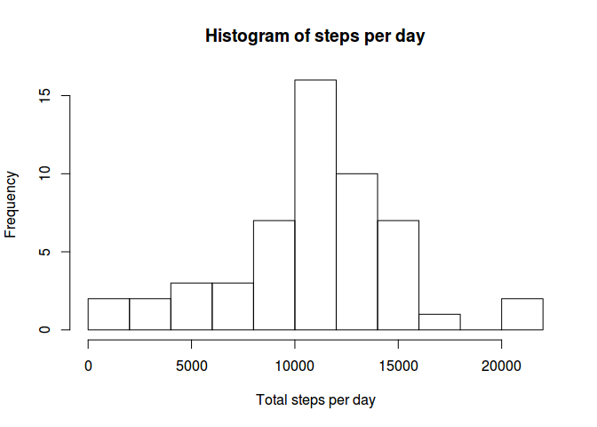
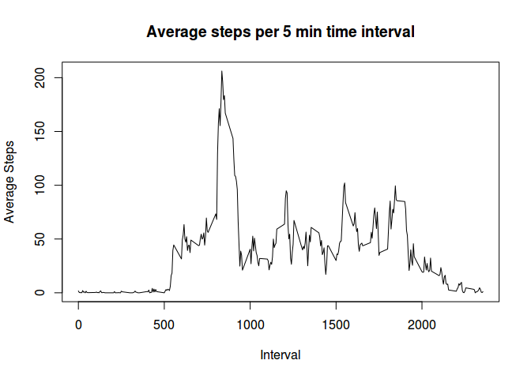
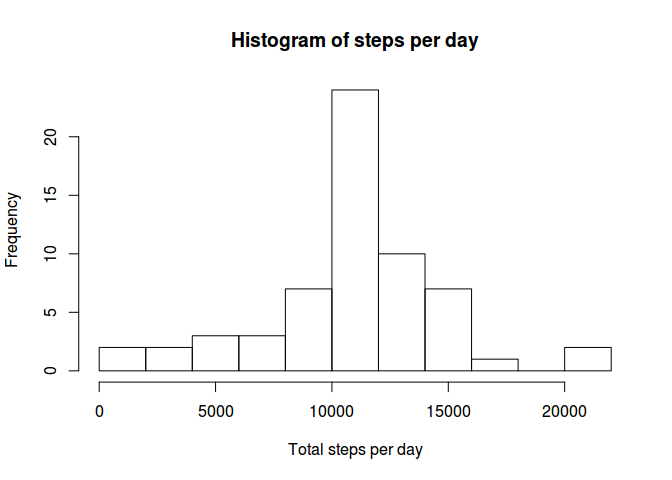
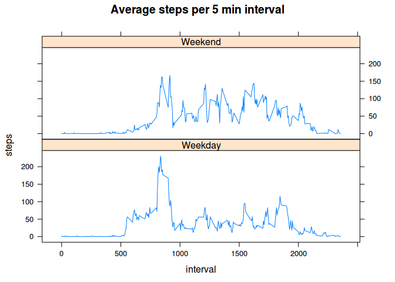

# Reproducible Research: Peer Assessment 1


## Loading and preprocessing the data

```r
library(dplyr)
```

```
## 
## Attaching package: 'dplyr'
## 
## The following objects are masked from 'package:stats':
## 
##     filter, lag
## 
## The following objects are masked from 'package:base':
## 
##     intersect, setdiff, setequal, union
```

```r
library(chron)
library(lattice)
options(scipen = 6, digits = 2)

activity <- read.csv(unz("activity.zip", "activity.csv"), stringsAsFactors = FALSE)
activity <- tbl_df(activity)

activity <- mutate(activity, date = as.Date(date,"%Y-%m-%d") )
activity
```

```
## Source: local data frame [17,568 x 3]
## 
##    steps       date interval
##    (int)     (date)    (int)
## 1     NA 2012-10-01        0
## 2     NA 2012-10-01        5
## 3     NA 2012-10-01       10
## 4     NA 2012-10-01       15
## 5     NA 2012-10-01       20
## 6     NA 2012-10-01       25
## 7     NA 2012-10-01       30
## 8     NA 2012-10-01       35
## 9     NA 2012-10-01       40
## 10    NA 2012-10-01       45
## ..   ...        ...      ...
```

## What is mean total number of steps taken per day?

```r
step_count <- activity %>%
    filter(!is.na(steps)) %>%
    group_by( date) %>%
    summarize(steps = sum(steps))

hist(step_count$steps, 
     breaks = 10,
     main = "Histogram of steps per day",
     xlab = "Total steps per day")
```

 

```r
steps_summary = summarize(step_count, 
          mean = mean(steps), 
          median= median(steps))
```
####**Mean of steps per day is 10766.19**

####**Median of steps per day is 10765**

## What is the average daily activity pattern?


```r
interval_steps <- activity %>%
    filter(!is.na(steps), !is.na(interval)) %>%
    group_by(interval) %>%
    summarize(steps = mean(steps))

with(interval_steps, plot(x = interval,
               y = steps,
               type = "l",
               main = "Average steps per 5 min time interval",
               xlab = "Interval",
               ylab = "Average Steps"
               ))
```

 

```r
max_steps_5min = top_n(interval_steps, 1)
```

```
## Selecting by steps
```

####**5 minute interval with maximum steps is 835**

## Imputing missing values

For filling in the missing values, take the mean of the average interval and assign it to the missing value

```r
step_count_no_na <- activity %>%
    group_by(interval) %>%
    mutate(steps = ifelse( is.na(steps), mean(steps, na.rm=T), steps)) %>%
    group_by( date) %>%
    summarize(steps = sum(steps))

hist(step_count_no_na$steps, 
     breaks = 10,
     main = "Histogram of steps per day",
     xlab = "Total steps per day")
```

 

```r
steps_summary_no_na = summarize(step_count_no_na, 
          mean = mean(steps), 
          median= median(steps))
```
**Mean of steps per day is 10766.19**

**Median of steps per day is 10766.19**

As expected there is no change in mean after filling in the missing values with the mean of the interval value.

## Are there differences in activity patterns between weekdays and weekends?

```r
weekends <- activity %>%
  group_by(interval) %>%
  mutate(steps = replace(steps, is.na(steps), mean(steps, na.rm=TRUE))) %>%
  mutate(day_type = factor( is.weekend(date) , labels = c("Weekday", "Weekend"))) %>%
  group_by(day_type, interval) %>%
  summarize(steps = mean(steps))


xyplot(steps ~ interval | day_type, 
       data = weekends, 
       layout = c(1,2),
       type="l",
       main="Average steps per 5 min interval")
```

 

For Weekday, the activity is mostly in the morning, but on weekends, the activity is spread throught the day
